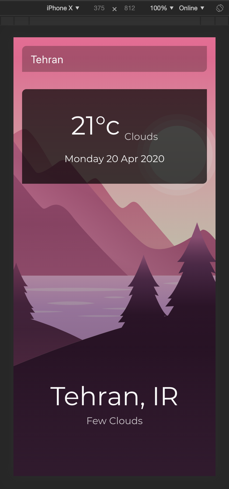

# Weather App

> Built with Vue js
>
> 👨🏻‍💻[Arsam Sarabi](https://arsam.dev)

## Running the app locally

- Copy & paste `.env.example`
- Rename to `.env`
- Add your own [Open Weather](https://openweathermap.org/api) API Key to the `VUE_APP_API_KEY` environment variable

